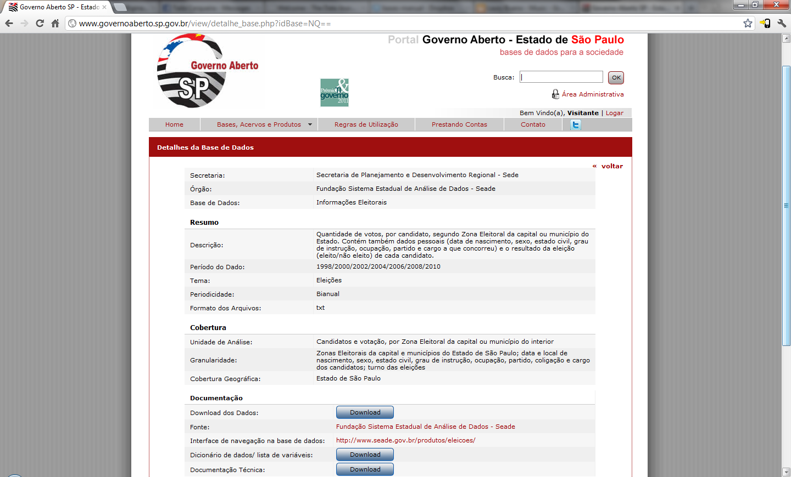

# Como fazer perguntas

Para conhecermos nossos números, devemos coloca-los sob controle. Eles devem ser transformados do formato em que estiverem em tabelas nos nossos bancos de MySQL.

Para as experiências deste manual, usaremos a base de dados bruta "Informações Eleitorais em SP" com dados de 1998/2000/2002/2004/2006/2008/2010. Os números estão disponíveis em formato CSV (comma separated value) pelo portal Governo Aberto, do Estado de São Paulo. Desde que este manual foi escrito em 2012, essa base passou por várias atualizações, portanto para ficar mais próximo dos exemplos apresentados aqui, você pode preferir usar [os dados da época](../arqs/dados-eleicoes-versao-2012.zip). A versão mais recente dessas informações está [disponível aqui](http://catalogo.governoaberto.sp.gov.br/dataset/16-informacoes-eleitorais). Esses dados também podem ser consultados online por [este link](http://produtos.seade.gov.br/produtos/eleicoes/).

As informações deste portal foram preferidas para uso no manual por já estarem mais organizadas e favorecerem o aprendizado. Além de já estarem em um formato mais agradável para uso em MySQL, eles estão acompanhados de referências e explicações sobre os significados de tabelas e colunas. Situação essa que infelizmente não é a regra.
Dados presos em tabelas de PDFs ou em extensas tabelas mal formatadas de HTML são formas mais recorrentes em que encontramos as informações públicas no dia a dia.

Como as formas de resgate desses dados podem variar muito de uma fonte para outra, no caso de estarem mal estruturados, é melhor usarmos outros que já estejam em uma formatação mais amigável para podermos focar o aprendizado em nossa interação com eles, em vez de na sua limpeza.

Apesar de, naturalmente, nos atermos às peculiaridades do banco de dados escolhido enquanto fazemos nossas análises e lidamos com problemas imprevistos, a ideia é que isso desenvolva uma atitude de “resolvedor de problemas” no jornalista. Algo que seja maior do que aprender a tratar especificamente os dados escolhidos.

Devemos aprender a lidar com percalços técnicos, inconsistências nos dados disponíveis, falhas de padronização e outras dificuldades.

Se estiver usando o site Governo Aberto, faça o download dos dados completos e também do “dicionário de variáveis”. Se você tiver baixado o pacote disponível acima para este manual, você já tem o dicionário no mesmo pacote que os dados.

/home/laury/dev/mysql-para-jornalistas/docs/img
