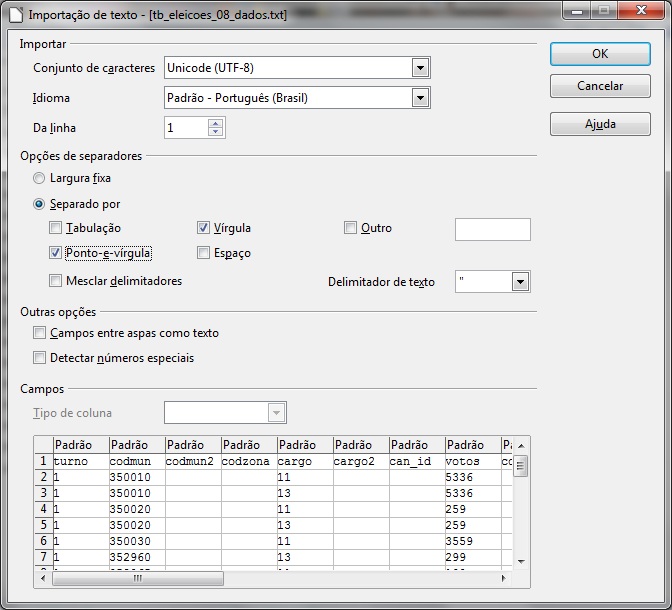

# Dados separados por vírgulas (CSV)

Os arquivos recebidos desse site vêm no padrão CSV (comma separated value), uma escolha comum para distribuir dados brutos pela internet. Tendo em vista essa preferência, vamos discutir um pouco de sua natureza e funcionamento.

É sempre bom observar que, apesar de os arquivos recebidos estarem formatados em CSV, eles não têm a terminação “.csv” tradicional para dados assim. Essa é uma característica que dificulta a identificação, mas não impede a interpretação por softwares.

Arquivos CSV são, em termos simples, uma forma de construir tabelas apenas com texto sem formatação. Para conseguir esse efeito, cada arquivo impõe que o caractere “,” será o separador das células da tabela.

Veja o exemplo de uma tabela hipotética sobre buracos nas ruas de uma cidade:

```plain
id,data,endereço,urgencia
1258,12/11/2010,Rua General Alberto Calado 158,7
1259,12/11/2010,Rua Rodrigues Alves 95,5
```

A primeira linha diz quais são os nomes das colunas presentes nessa tabela. A primeira coluna é “id”, a segunda “data”, a terceira “endereco” e a última “urgencia”. Repare que não há acentos nem espaços nas vírgulas. Isso não é uma regra geral para esse tipo de arquivo, mas é frequente.

A segunda linha do arquivo faz o papel de primeira linha de dados da tabela e segue o mesmo padrão da formatação de colunas. Olhando para essas linhas, podemos perceber que o buraco com “id” igual a “1259” fica na rua “Rua Rodrigues Alves 95”.

Ou seja, os dados apresentados equivalem à seguinte tabela:

| id | data | endereço | urgencia |
| ------------ | ------------- | ------------ | ------------ |
| 1258 | 12/11/2010 | Rua General Alberto Calado 158 | 7 |
| 1259 | 12/11/2010 | Rua Rodrigues Alves 95 | 5 |

Apesar de levar vírgula (“comma”) no nome, esse tipo de arquivo nem sempre tem suas separações determinadas por vírgulas. Outros caracteres, como o ponto-e-vírgula, podem desempenhar esse papel caso seja conveniente. Justamente o exemplo posto poderia se beneficiar dessa troca, já que é comum endereços terem vírgulas para separar o nome da rua do número da residência. No caso, deixamos apenas o espaço em branco para não gerar confusão na contagem de colunas e misturar os dados, mas definir ponto-e-vírgula como o separador teria sido a solução ideal.

Como há variações de padrão desse tipo, nem sempre um processador de planilhas como o Microsoft Excel será capaz de abrir um arquivo CSV com a separação de colunas correta. Para ter maior flexibilidade, prefira o [LibreOffice Calc](https://pt-br.libreoffice.org/baixe-ja/libreoffice-stable/), um software livre e disponível gratuitamente na internet. O arquivo que baixamos no portal Governo Aberto, por exemplo, não será corretamente aberto pelo Excel, mas pode ser pelo Calc.



Em “Opções de separadores”, selecione “ponto-e-vírgula”. Abaixo, você já pode ver se a tabela será exibida corretamente com as opções selecionadas. Com outros arquivos encontrados na internet, você pode ter que mexer em mais opções para conseguir ver corretamente a informação.

Pode ser preciso dar atenção também à função “Conjunto de caracteres”, também conhecida como “Encoding”. Essa característica se refere à forma como caracteres com acentos são salvos no arquivo. No caso anterior, não foi necessário nos preocuparmos com isso, pois só havia números na tabela, mas os próximos arquivos que formos importar terão também textos, de forma que precisaremos descobrir com qual “encoding” foram criados.

Vamos pegar como exemplo o arquivo “tb_eleicoes_00_variavel.txt”. Tente abri-lo no Calc. Assim como no arquivo anterior, você pode ver uma tela de preview, que procura mostrar como o arquivo ficará se for aberto com as configurações selecionadas. Desta vez, além de prestar atenção na tabulação, procure por palavras que tenham acentos ou letras especiais como “ç”. Se essas palavras estiverem sendo mostradas corretamente, não há com o que se preocupar, mas se não estiverem, é preciso tentar outras opções em “encoding”.

As opções mais frequentes são UTF-8 e ISO-8859-1 (que neste caso é o correto). Você também vai notar que outros encodings também podem abrir corretamente esse arquivo. Isso acontece porque a forma como eles interpretam caracteres têm muitos pontos em comum uns com os outros. Apenas fique atento a acentos e cedilhas e escolha a codificação que melhor se adaptar ao texto que está tentando visualizar.
