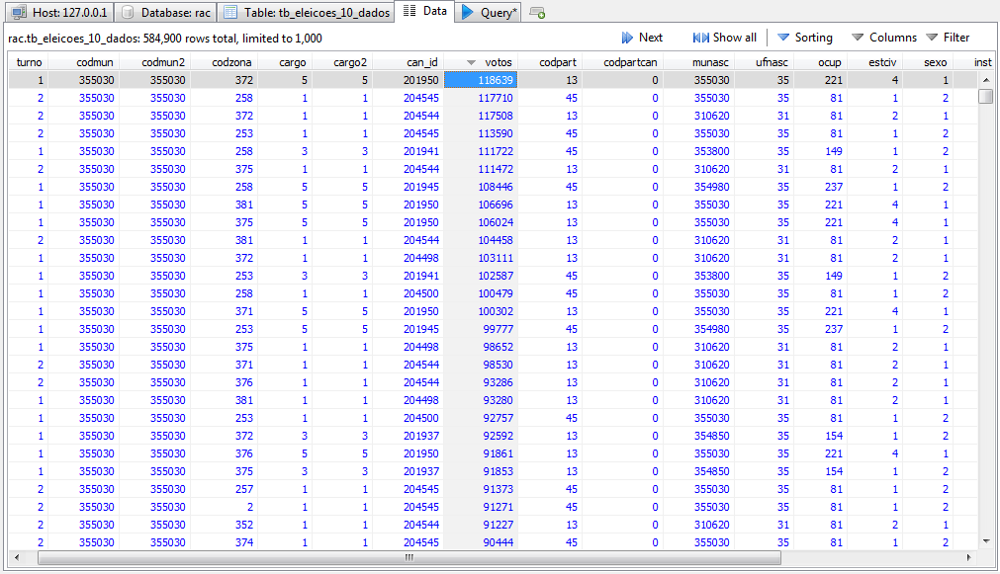

# O que é isto?

De um jornalista, para outros jornalistas, este manual foi feito com a esperança de ser útil na busca da verdade em meio a dados abertos que nem sempre são consistentes.

# O que eu posso aprender aqui?

Softwares de processamento de planilhas, como o Excel, são ótimos para lidar com dados, mas eles nem sempre nos dão poder suficiente para processar a informação do jeito que precisamos.

Para lidar com essas situações, exitem alternativas avançadas e acessíveis para jornalistas como [R](https://www.r-project.org/), [Python](https://www.python.org/) e [SQLite](https://sqlite.org/). Cada uma delas tem seus próprios prós e contras.

Neste manual, vamos entender como funciona e como podemos usar o [MySQL](https://www.mysql.com/) para processar, analisar e cruzar grandes quantidades de dados enquanto tentamos escrever uma matéria investigativa.

*Parece meio assustador, mas nós vamos chegar lá com um pouco de perseverança.*

# Por onde começar?
Se você sente que ainda precisa de um pouco de motivação ou contexto para mergulhar neste mundo, pode dar uma lida nos [porquês deste manual](por_que/isto_importa.md).

Do contrário, [prepare suas ferramentas](tutoriais/introducao.md) e vamos à batalha.

Mas se você estiver se sentindo especialmente corajoso hoje, vá direto para [a parte boa](/entrevista_com_dados/perguntas/).
