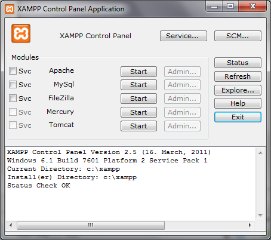
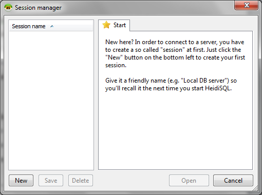
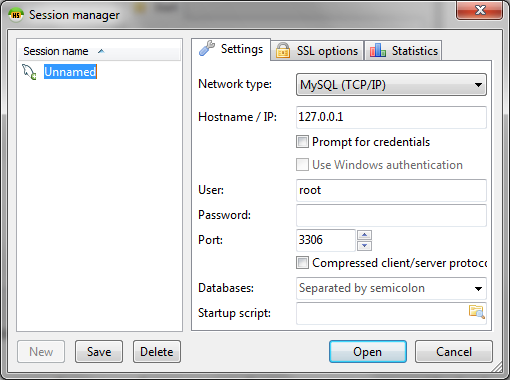
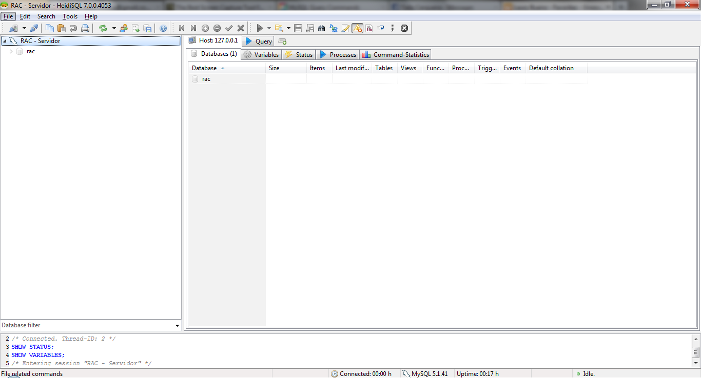

# Xampp: um servidor MySQL prático

O Xampp será a base de todo o nosso trabalho. Nele ficarão armazenadas as informações de todas as nossas tabelas.

Após concluída a instalação, você deverá interagir com o painel de controle. Use o botão “Start” das linhas MySQL e Apache. Não se preocupe com este último nome. Ele é um servidor web, ou seja, permite que o Xampp entre em contato com navegadores, como Firefox, por meio de websites. Ele será necessário apenas desta vez. Não vamos nos deter em sua definição.

Espere aparecer a mensagem “Running” em ambos e abra o navegador de sua preferência. Acesse [http://localhost/](http://localhost/). O site que você vê agora está hospedado no seu próprio computador e pode ser usado independentemente de qualquer conexão com a internet. Escolha inglês como seu idioma. Infelizmente, nem todas as páginas de que precisaremos estarão disponíveis em português neste processo.

## Segurança
Apesar de não estar disponível na internet, esse site, assim como os dados que utilizaremos em nosso MySQL, podem ser acessados pela rede interna de sua casa ou empresa. Apenas para fins de segurança, vamos impedir esse livre acesso. Esse processo só precisa ser executado uma vez.

Clique em “Security” no menu à esquerda. Na nova página, procure pelo link “xamppsecurity” logo abaixo da tabela que lista vulnerabilidades. Escolha uma senha para proteger o usuário “root”, aquele que utilizaremos neste manual e tem livre acesso a todos os dados guardados no sistema.

Para os usuários de Mac OS, essa configuração é mais penosa, pois exige, não só o uso de linhas de comando, como também acesso de administrador.

Volte ao painel de controle do Xampp e escolha “Stop” tanto para Apache quanto para MySQL. Após a parada total de ambos, reative o MySQL. Esse procedimento garante que nossa melhoria na segurança tenha efeito imediatamente.

# Um "Excel" para MySQL: HeidiSQL

Esse software é apenas uma das muitas possibilidades de interfaces gráficas para MySQL. Você pode usar a que lhe convier. Escolhemos o [HeidiSQL](http://www.heidisql.com/download.php) para este manual por lidar mais rapidamente com grandes carregamentos de dados; situação essa que deveremos enfrentar diversas vezes com informações brutas fornecidas por governos. Mais adiante, teremos que cruzar uma tabela de quase 600 mil linhas com outras não muito menores. Essa quantidade de dados representa grande esforço não só para o próprio MySQL, como também para a interface gráfica que escolhemos.

Outra ferramenta também bastante robusta é o phpMyAdmin, que faz parte do pacote Xampp e pode ser encontrado aqui [http://localhost/phpmyadmin/](http://localhost/phpmyadmin/) (enquanto você estiver com o servidor ligado, é claro). Lembre-se apenas que, para usá-lo, são necessários tanto o servidor MySQL quanto o Apache rodando em seu computador. Se não está claro para você como fazer isso, [leia este guia sobre Xampp](#xampp-um-servidor-mysql-pratico).

Para começarmos, devemos configurar o acesso do programa para nosso servidor local. Clique em “New”.

Mude o nome da sessão que estamos criando de “Unnamed” para “RAC - Servidor”, ou outro nome que preferir. No campo “password”, escreva a senha que escolheu para seu usuário “root” após a instalação do Xampp. Clique em “Save” e em “Open”.

A partir de agora, você deve ficar atento às diferenças entre letras maiúsculas e minúsculas que usar em tudo que escrever. Para nomes de bancos de dados, por exemplo, “Rac” é diferente de “rac” que é diferente de “RAC”.

Agora, deve-se abrir para você a janela principal do HeidiSQL. Ela servirá a quase todos os nossos trabalhos de Reportagem com o Auxílio do Computador. Mas, primeiro, vamos criar um banco de dados para mantermos nossos exercícios separados de outras informações que você poderá inserir nesse sistema no futuro.

Na coluna à esquerda, clique com o botão direito do mouse sobre “RAC - Servidor”. As opções que vão aparecer se referem ao seu servidor local de banco de dados. Neste momento, queremos criar um banco novo. Escolha “Create New” -> ”Database”.

Chame o banco de dados de “rac”, em “Character set” escolha “latin1” e em “Collation” selecione “latin1_general_ci”. Essa configuração deve dar conta da maior parte dos bancos de dados em português que você poderá encontrar de fontes brasileiras. Essa informação diz respeito a caracteres especiais que poderemos inserir no sistema. Letras com acentos, por exemplo, podem ser afetadas se você fizer a escolha errada neste momento. Apesar de importante, ela sempre pode ser modificada no futuro.

Se essa não for a combinação correta, você também pode tentar o muito utilizado “utf8” com “utf8_general_ci”.

Repare que, nessa mesma janela, há alguns comandos em formato de texto logo abaixo. Se você continuar mexendo nas configurações, verá que eles mudam de acordo. Isso ajuda a esclarecer o verdadeiro papel do HeidiSQL em nosso trabalho. Ele escreve comandos chatos no nosso lugar. Ou seja, faz com mais agilidade coisas corriqueiras como criar bancos, tabelas ou ler resultados simples.

Mas, é importante lembrar que para tirar proveito da flexibilidade que esse ambiente proporciona, é preciso entender muito bem essa linguagem. Portanto, não a ignore.
