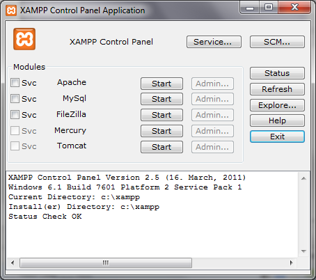
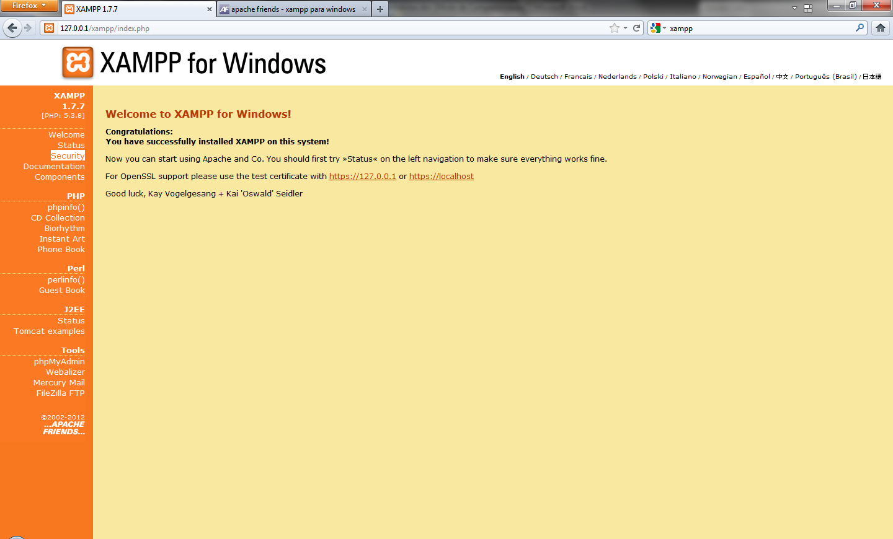

# Xampp

Ele será a base de todo o nosso trabalho. Nele ficarão armazenadas as informações de todas as nossas tabelas.

Após concluída a instalação, você deverá interagir com o painel de controle. Use o botão “Start” das linhas MySQL e Apache. Não se preocupe com este último nome. Ele é um servidor web, ou seja, permite que o Xampp entre em contato com navegadores, como Firefox, por meio de websites. Ele será necessário apenas desta vez. Não vamos nos deter em sua definição.

Espere aparecer a mensagem “Running” em ambos e abra o navegador de sua preferência. Acesse [http://localhost/](http://localhost/). O site que você vê agora está hospedado no seu próprio computador e pode ser usado independentemente de qualquer conexão com a internet. Escolha inglês como seu idioma. Infelizmente, nem todas as páginas de que precisaremos estarão disponíveis em português neste processo.

Apesar de não estar disponível na internet, esse site, assim como os dados que utilizaremos em nosso MySQL, podem ser acessados pela rede interna de sua casa ou empresa. Apenas para fins de segurança, vamos impedir esse livre acesso. Esse processo só precisa ser executado uma vez.

Clique em “Security” no menu à esquerda. Na nova página, procure pelo link “xamppsecurity” logo abaixo da tabela que lista vulnerabilidades. Escolha uma senha para proteger o usuário “root”, aquele que utilizaremos neste manual e tem livre acesso a todos os dados guardados no sistema.

Para os usuários de Mac OS, essa configuração é mais penosa, pois exige, não só o uso de linhas de comando, como também acesso de administrador.

Volte ao painel de controle do Xampp e escolha “Stop” tanto para Apache quanto para MySQL. Após a parada total de ambos, reative o MySQL. Esse procedimento garante que nossa melhoria na segurança tenha efeito imediatamente.
